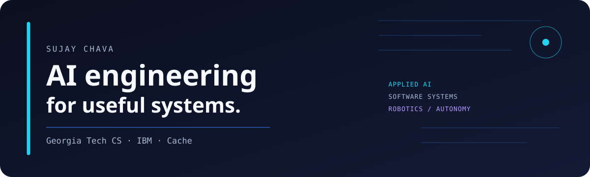
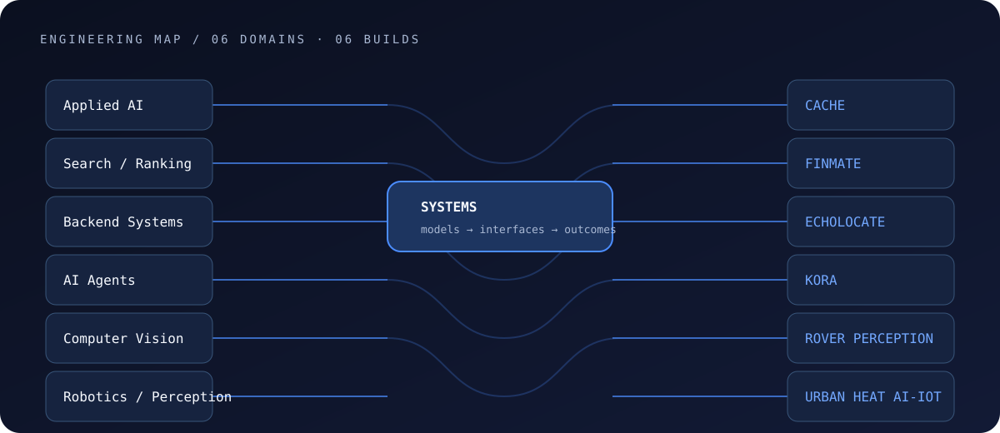
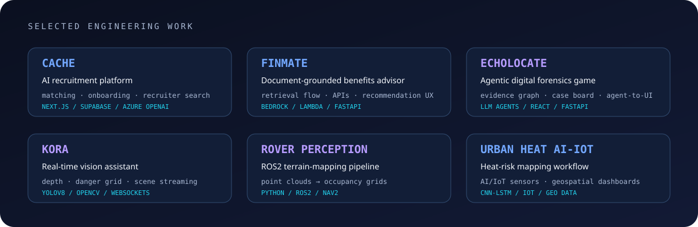
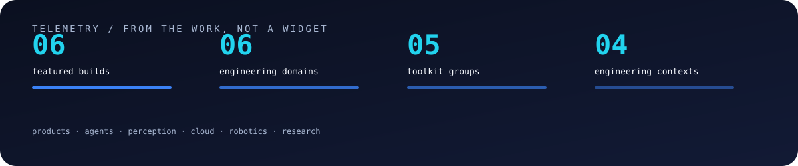
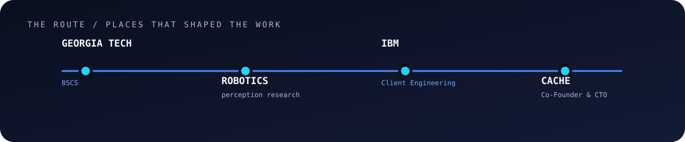
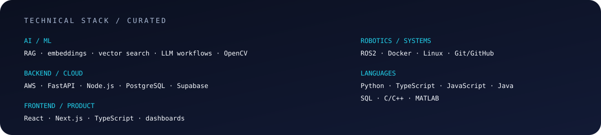

<a href="https://linkedin.com/in/sujaychava">LinkedIn</a> · <a href="mailto:schava32@gatech.edu">Email</a> · <a href="https://devpost.com/SujayCh07">Devpost</a> · <a href="https://github.com/SujayCh07">GitHub</a>

I build AI products and software systems that turn complex information into useful workflows — from recruiting search and document-grounded recommendations to agent interfaces, robotics perception, and real-time vision.

## Selected engineering work

| Project | Purpose | My contribution | Link |
| --- | --- | --- | --- |
| **Cache** | AI recruitment platform for structured student profiles, recruiter search, and matching | Co-Founder & CTO: matching, onboarding, auth, recruiter workflows | [case study](https://github.com/SujayCh07/cache-case-study-sujayc) |
| **FinMate** | Document-grounded benefits advisor | Retrieval flow, backend APIs, recommendation UX with team | [repository](https://github.com/SujayCh07/finmate-ai-benefits-advisor-sujayc) |
| **EchoLocate** | Agentic AI digital forensics game | Agent-to-UI workflows, evidence graph, case board, investigation interface | [repository](https://github.com/SujayCh07/agentic-digital-forensics-simulator-sujayc) |
| **Kora** | Real-time AI vision assistant for accessibility | Detection/depth pipeline, spatial danger grid, real-time scene streaming | [repository](https://github.com/SujayCh07/kora-ai-vision-assistant-sujayc) |
| **Rover Perception** | ROS2 terrain-understanding pipeline | Point-cloud to occupancy-grid pipeline for live rover testing | [repository](https://github.com/SujayCh07/lunar-rover-perception-sujayc) |
| **Urban Heat AI-IoT** | Heat-risk mapping and mitigation workflow | AI/IoT heat mapping and geospatial dashboard workflow | — |

## The route

## Technical stack

## Current focus

- Building **Cache**, an AI recruitment platform for structured student profiles, recruiter search, and candidate matching.
- Working in **IBM Client Engineering** on enterprise AI workflows, automation, and technical enablement.
- Building applied AI and cloud projects with RAG, agents, AWS, FastAPI, React, and real-time systems.
- Researching robotics perception: turning rover sensor data into navigation-ready terrain maps.

I’m interested in internships and technical roles around applied AI, cloud engineering, solutions architecture, full-stack AI products, and robotics perception.

<a href="mailto:schava32@gatech.edu">schava32@gatech.edu</a> · <a href="https://linkedin.com/in/sujaychava">linkedin.com/in/sujaychava</a>

